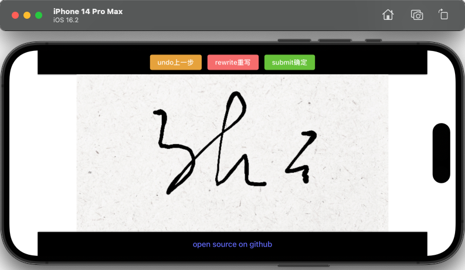
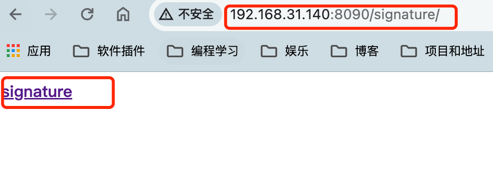

# Mobile online signature board

[](https://github.com/RichardLitt/standard-readme)
TODO: Put more badges here.

一款移动端的在线签字版软件，可以通过手机浏览器等扫码签字

TODO: 2023年上半年，重新构建了签字版的架构，为笔迹增加了粗细变化，更好的模拟了签字笔的效果，同时签字板模拟了纸张的背景，增强了用户体验。

TODO：In the first half of 2023, the structure of the signature board was rebuilt, adding thickness changes to the handwriting, better simulating the effect of a signature pen, and at the same time, the signature board simulates the background of paper, enhancing the user experience.

## Table of Contents

- [Background](#background)
- [Effect](#effect)
- [Install](#install)
- [Usage](#usage)
- [API](#api)
- [Maintainers](#maintainers)
- [Contributing](#contributing)
- [License](#license)

## Background

The original reason for creating this project was that a certain project of the company involved some audit steps, which required the signature of the auditor. At the beginning, a lot of signed version hardware was purchased, but the limitations were too large, the hardware was easily damaged, and the price was high. And it is not easy to carry. Later, I decided to use the solution of scanning the code to sign. Put a button where the audit node needs to sign, click the button to pop up the QR code, scan the QR code on the mobile phone and sign, and return to the PC to get the signature picture after signing.

创建这个项目的最初原因是公司的某个项目涉及到了一些审核步骤，这些审核步骤需要审核人亲自签字，一开始采购了很多签字版硬件，但局限性太大，硬件容易损坏，价格不菲，而且不易携带，后来就决定使用扫码签字的方案，在审核节点需要签字的地方放一个按钮，点击按钮弹出二维码，手机微信扫码后签字，签字完成再返回到PC端获取签名图片即可。


## Effect



## Install

### Install with Docker Compose

参考：https://github.com/haust-lyb/signature/tree/main/signature-docker-compose

下载signature-docker-compose文件夹，并cd进入该文件夹，执行一下命令启动
```shell
docker compose up -d
```

启动后访问 http://yourip:8090/signature/
看到signature字样说明签字服务已经启动完成了



## Usage

原理：利用浏览器多窗口之间的通讯，调用者页面只需要通过window.open打开特定的签字服务地址，并通过window.addEventListener('message', someFun)添加窗口间通信监听，即可完成对接。
具体代码可参考 [a-springboot-application](https://github.com/haust-lyb/signature/blob/main/springboot-demo/src/main/resources/templates/index.html)

## Maintainers

[@haust-lyb](https://github.com/haustlyb)

## Contributing

PRs accepted.

Small note: If editing the README, please conform to the [standard-readme](https://github.com/RichardLitt/standard-readme) specification.

## License

[Apache-2.0 license](https://github.com/haust-lyb/signature/blob/main/LICENSE) © 2023 [haustlyb](https://github.com/haust-lyb)
